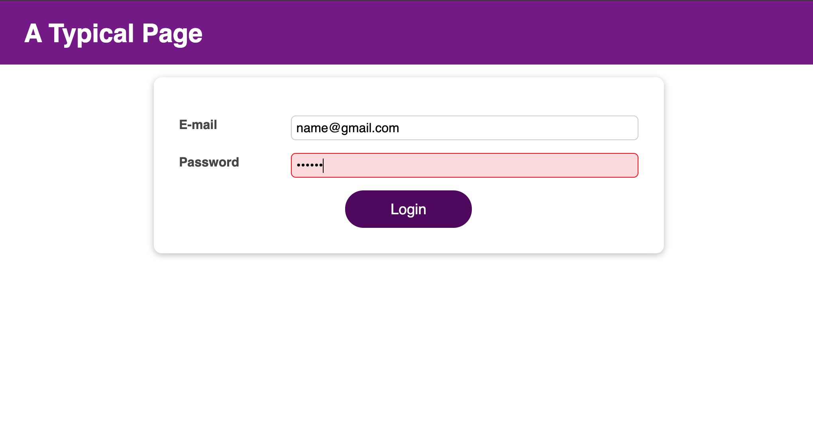
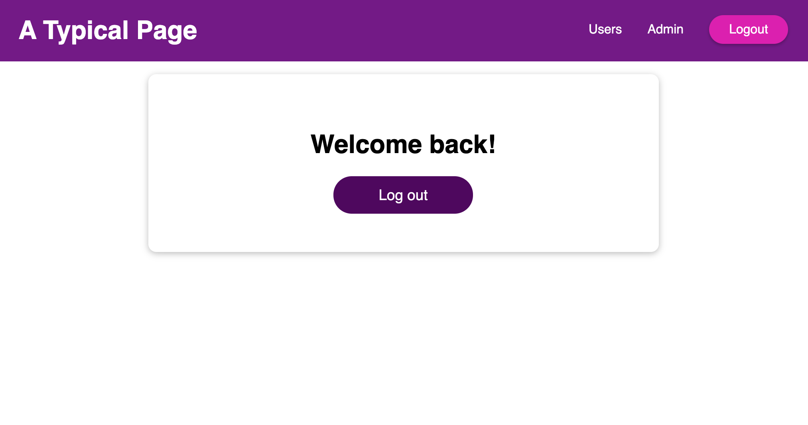

## Login Form Example
Login form example with usage of React Context, Reducer, Effect and Ref hooks
<ul>
  <li>useState()</li>
  <li>useEffect()</li>
  <li>useReducer()</li>
  <li>useContext()</li>
  <li>useImperativeHandle()</li>
</ul>

### Showcase

