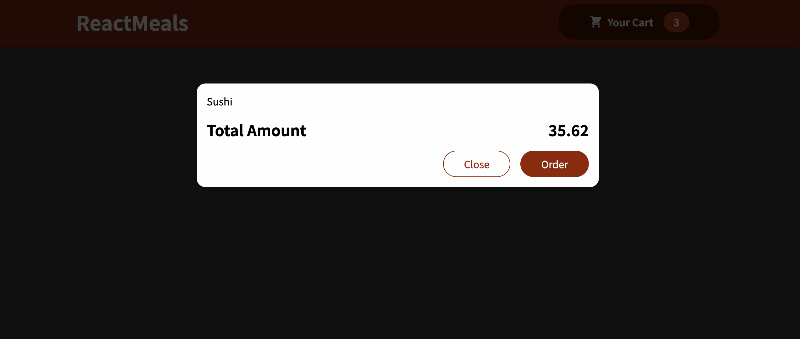

### Modal example
Modal example with backdrop and using react portals

React portals enable us to use components whereever we want, but to render them in the specific place within DOM

### Showcase
